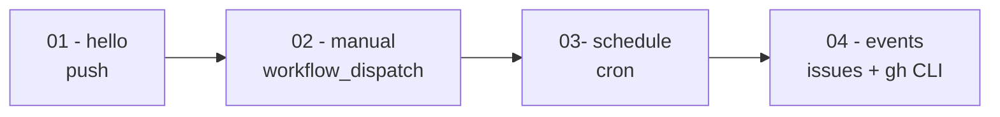

# Laboratorio de práctica: GitHub Actions

Repositorio de aprendizaje para **CI/CD con GitHub Actions**. No incluye código de aplicación: el contenido del laboratorio son los workflows en [`.github/workflows/`](.github/workflows/).

**Repositorio remoto:** [julianandrescaracas0623/CI_CD_GITHUB_ACTIONS](https://github.com/julianandrescaracas0623/CI_CD_GITHUB_ACTIONS)

## Objetivo

Aprender los conceptos fundamentales de GitHub Actions de forma progresiva:

- Triggers (`push`, `workflow_dispatch`, `schedule`, eventos de issues)
- Jobs y steps
- Inputs y condiciones (`if`)
- Permisos y tokens
- Automatización con GitHub CLI (`gh`)



## Requisitos previos

- Cuenta de GitHub
- Repositorio clonado o fork de este proyecto
- Acceso a la pestaña **Actions** del repositorio
- (Opcional) [GitHub CLI](https://cli.github.com/) instalado para pruebas locales

## Estructura del repositorio

| Workflow | Archivo | Trigger | Conceptos clave |
|----------|---------|---------|-----------------|
| 01 - hello | [`.github/workflows/01-hello.yml`](.github/workflows/01-hello.yml) | `push` en `main` | jobs, steps, `runs-on`, `actions/checkout@v4` |
| 02 - manual | [`.github/workflows/02-manual.yml`](.github/workflows/02-manual.yml) | `workflow_dispatch` | inputs (`choice`, `environment`, `boolean`, `string`), condiciones `if`, dry-run |
| 03- schedule | [`.github/workflows/03-schedule.yml`](.github/workflows/03-schedule.yml) | `schedule` (cron) | expresiones cron, zona horaria UTC |
| 04 - events | [`.github/workflows/04-events.yml`](.github/workflows/04-events.yml) | `issues`, `issue_comment` | eventos, `permissions`, `gh issue comment`, contexto `github.event` |

---

## Módulo 01 — Hello World

**Archivo:** [`.github/workflows/01-hello.yml`](.github/workflows/01-hello.yml)

### Qué aprendes

- Definir un workflow con trigger `push`
- Ejecutar varios **jobs** en paralelo
- Usar **steps** con comandos shell (`run`)
- Descargar el código del repo con una action oficial (`actions/checkout@v4`)

### Cómo dispararlo

1. Haz un commit y push a la rama `main`
2. Ve a **Actions** en GitHub
3. Selecciona el workflow **01 - hello**

### Qué esperar

Se ejecutan dos jobs en paralelo:

- **`hello`:** imprime "Hello World", la fecha/hora y el listado de archivos del runner
- **`repo-files`:** descarga el código del repositorio con `actions/checkout@v4`

### Fragmento clave

```yaml
on:
  push:
    branches: [main]

jobs:
  hello:
    runs-on: ubuntu-24.04
    steps:
      - name: saludar
        run: echo "Hello World"
```

---

## Módulo 02 — Ejecución manual

**Archivo:** [`.github/workflows/02-manual.yml`](.github/workflows/02-manual.yml)

### Qué aprendes

- Disparar workflows manualmente con `workflow_dispatch`
- Pasar **inputs** al workflow desde la interfaz de GitHub
- Usar condiciones `if` para ejecutar steps según los parámetros
- Simular despliegues con el patrón **dry-run**

### Cómo dispararlo

1. Ve a **Actions** → **02 - manual**
2. Pulsa **Run workflow**
3. Elige la rama y rellena los inputs:

| Input | Tipo | Descripción |
|-------|------|-------------|
| `log_level` | choice | Nivel de log: `info`, `debug`, `warning`, `error` |
| `environment` | environment | Entorno de GitHub (staging, production, etc.) |
| `dry_run` | boolean | Si es `true`, no aplica cambios reales |
| `reason` | string | Motivo de la ejecución (auditoría) |

4. Pulsa **Run workflow**

> **Nota:** el input `environment` usa los entornos configurados en **Settings → Environments**. Si no tienes ninguno creado, puedes dejarlo vacío o crear uno de prueba.

### Qué esperar

- Siempre se muestran los valores de los inputs en los logs
- Si `dry_run` es `false`: se ejecuta el step `deploy` (simulado con `echo`)
- Si `dry_run` es `true`: solo aparece el mensaje "Dry run: no changeds applied"

### Fragmento clave

```yaml
on:
  workflow_dispatch:
    inputs:
      dry_run:
        type: boolean
        default: false

# ...

      - name: deploy (solo si no es dry_run)
        if: ${{ !inputs.dry_run }}
        run: echo "deploy to $ENVIRONMENT"
```

---

## Módulo 03 — Programación con cron

**Archivo:** [`.github/workflows/03-schedule.yml`](.github/workflows/03-schedule.yml)

### Qué aprendes

- Programar workflows con el trigger `schedule`
- Escribir expresiones **cron** válidas
- Entender que GitHub Actions usa **UTC** como zona horaria

### Configuración actual

```yaml
- cron: '0 9 * * MON'
```

Esto significa: **todos los lunes a las 09:00 UTC**.

Formato cron en GitHub Actions (5 campos):

```
minuto  hora  día_del_mes  mes  día_de_la_semana
  0      9       *         *        MON
```

### Cómo dispararlo

No requiere acción manual: GitHub lo ejecuta automáticamente según el cron.

Para verificar:

1. Espera a la próxima ejecución programada, o
2. Revisa en **Actions** → **03- schedule** las ejecuciones pasadas

> **Importante:** GitHub puede retrasar o omitir ejecuciones programadas en repositorios inactivos. Para pruebas rápidas, puedes temporalmente cambiar el cron a un intervalo corto (por ejemplo, cada hora: `'0 * * * *'`) y revertirlo después.

### Qué esperar

En los logs del job aparece:

```
Scheduled run
```

---

## Módulo 04 — Eventos de Issues

**Archivo:** [`.github/workflows/04-events.yml`](.github/workflows/04-events.yml)

### Qué aprendes

- Reaccionar a eventos del repositorio (`issues`, `issue_comment`)
- Acceder al contexto del evento con `github.event`
- Configurar **permissions** para que el workflow pueda escribir en issues
- Usar **GitHub CLI** (`gh`) dentro de un workflow

### Cuándo se dispara

| Evento | Tipos |
|--------|-------|
| `issues` | `opened`, `closed`, `reopened`, `edited` |
| `issue_comment` | `created` |

### Cómo dispararlo

1. Ve a la pestaña **Issues** del repositorio
2. Crea un **nuevo issue** (título y descripción cualquiera)
3. Ve a **Actions** → **04 - events** y revisa la ejecución

También puedes probar cerrando, reabriendo o editando un issue, o añadiendo un comentario.

### Qué esperar

**Step 1 — inspeccionar evento:** imprime en logs el nombre del evento, el título del issue y el cuerpo del comentario (si aplica).

**Step 2 — comentar como bot:** solo se ejecuta cuando se **abre** un issue nuevo. El bot deja un comentario automático:

> Gracias por tu comentario. Nosotros lo tomaremos en cuenta.

### Fragmento clave

```yaml
permissions:
  issues: write

      - name: Comentar como bot en github actions
        if: github.event_name == 'issues' && github.event.action == 'opened'
        env:
          GITHUB_TOKEN: ${{ secrets.GITHUB_TOKEN }}
        run: |
          gh issue comment "$ISSUE_NUMBER" --body "Gracias por tu comentario..." -R "$GITHUB_REPOSITORY"
```

> El mensaje dice "comentario" pero el step solo se dispara al **abrir** un issue, no al recibir un comentario. Para responder a comentarios habría que añadir un step con `github.event_name == 'issue_comment'`.

---

## Errores comunes y soluciones

| Error | Causa | Solución |
|-------|-------|----------|
| `Tabs are not allowed as indentation` | YAML con tabuladores | Usar solo espacios para indentar (2 espacios por nivel) |
| `Invalid cron expression` | Campos cron mal separados | `'0 9 * * MON'` — cada campo separado por espacio; no escribir `9*` |
| `gh issue comment: accepts 1 arg(s), received 2` | El texto del comentario como segundo argumento posicional | Usar `--body` para el mensaje: `gh issue comment "$ISSUE_NUMBER" --body "texto" -R "$GITHUB_REPOSITORY"` |
| El workflow programado no corre | Repo inactivo o cron en UTC | Verificar la hora en UTC; activar el repo con un push si estuvo inactivo |

---

## Orden recomendado de práctica

1. **Push a `main`** → observar el workflow **01 - hello**
2. **Run workflow** manual con `dry_run = false` y luego con `dry_run = true` → **02 - manual**
3. **Revisar el cron** en **03- schedule** y esperar (o ajustar temporalmente) la ejecución programada
4. **Crear un issue** y verificar el comentario automático del bot → **04 - events**

---

## Recursos adicionales

- [Documentación de GitHub Actions](https://docs.github.com/en/actions)
- [Eventos que disparan workflows](https://docs.github.com/en/actions/using-workflows/events-that-trigger-workflows)
- [Sintaxis de workflow](https://docs.github.com/en/actions/using-workflows/workflow-syntax-for-github-actions)
- [GitHub CLI — issue comment](https://cli.github.com/manual/gh_issue_comment)
